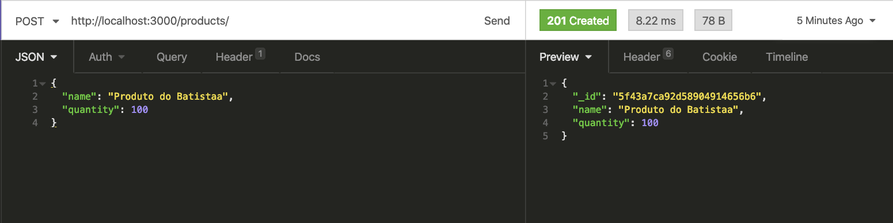
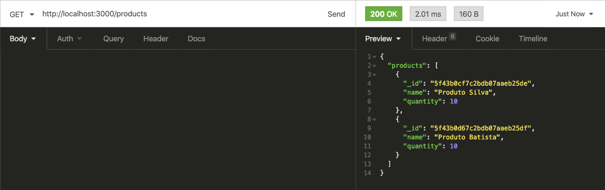
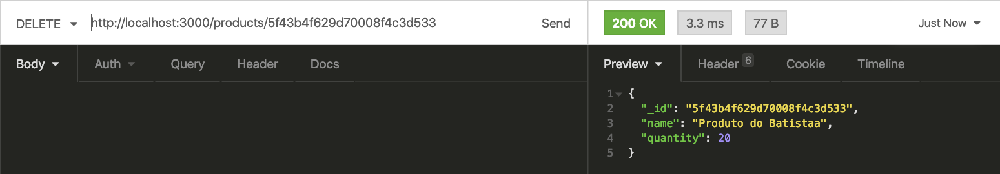
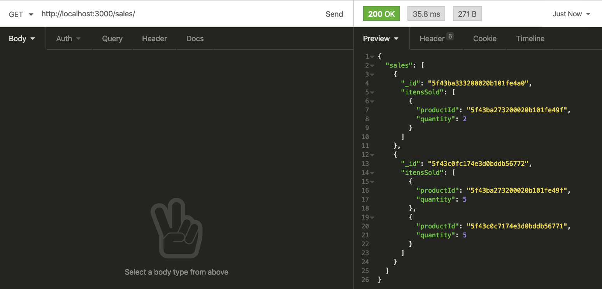
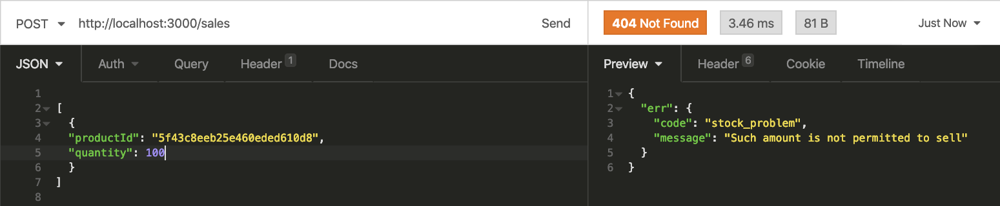

## Projeto Store Manager!

### Habilidades

- Entender o funcionamento da camada de Model;
- Delegar responsabilidades específicas para essa camada;
- Conectar sua aplicação com diferentes bancos de dados;
- Estruturar uma aplicação em camadas;
- Delegar responsabilidades específicas para cada parte do seu app;
- Melhorar manutenibilidade e reusabilidade do seu código;
- Entender e aplicar os padrões REST;
- Escrever assinaturas para APIs intuitivas e facilmente entendíveis.

---

Desenvolvi uma API utilizando a arquitetura MSC!

A API construída trata-se de um sistema de gerenciamento de vendas, onde será possível criar, visualizar, deletar e atualizar produtos e vendas.

---

### Requisitos do projeto

#### 1 - Crie um endpoint para o cadastro de produtos

- O endpoint deve ser acessível através do caminho (`/products`);

- Os produtos enviados devem ser salvos em uma **collection** do MongoDB;



#### 2 - Crie um endpoint para listar os produtos

- O endpoint deve ser acessível através do caminho (`/products`) ou (`/products/:id`);

- Através do caminho `/products`, todos os produtos devem ser retornados;

- Através do caminho `/products/:id`, apenas o produto com o `id` presente na URL deve ser retornado;



#### 3 - Crie um endpoint para atualizar um produto

- O endpoint deve ser acessível através do caminho (`/products/:id`);

- O corpo da requisição deve seguir a mesma estrutura do método responsável por adicionar um produto;

- Apenas o produto com o `id` presente na URL deve ser atualizado;


#### 4 - Crie um endpoint para deletar um produto

- O endpoint deve ser acessível através do caminho (`/products/:id`);

- Apenas o produto com o `id` presente na URL deve ser deletado;



#### 5 - Crie um endpoint para cadastrar vendas

- O endpoint deve ser acessível através do caminho (`/sales`);

- As vendas enviadas devem ser salvas em uma `collection` do MongoDB;

- Deve ser possível cadastrar a venda de vários produtos através da uma mesma requisição;

#### 6 - Crie um endpoint para listar as vendas

- O endpoint deve ser acessível através do caminho (`/sales`) ou (`/sales/:id`);

- Através do caminho `/sales`, todas as vendas devem ser retornadas;

- Através do caminho `/sales/:id`, apenas a venda com o `id` presente na URL deve ser retornada;



#### 7 - Crie um endpoint para atualizar uma venda

- O endpoint deve ser acessível através do caminho (`/sales/:id`);

- O corpo da requisição deve receber a seguinte estrutura:

```json
[
  {
    "productId": "5f3ff849d94d4a17da707008",
    "quantity": 3
  }
]
```

- `quantity` deve ser um número inteiro maior que 0;

- Apenas a venda com o `id` presente na URL deve ser atualizada;

#### 8 - Crie um endpoint para deletar uma venda

- O endpoint deve ser acessível através do caminho (`/sales/:id`);

- Apenas a venda com o `id` presente na URL deve ser deletado;

#### 9 - Atualize a quantidade de produtos

- Ao realizar uma venda, atualizá-la ou deletá-la, você deve também atualizar a quantidade do produto em questão presente na `collection` responsável pelos produtos;

- Por exemplo: suponha que haja um produto chamado _Bola de Futebol_ e a sua propriedade `quantity` tenha o valor _10_. Caso seja feita uma venda com _8_ unidades desse produto, a quantidade do produto deve ser atualizada para _2_ , pois 10 - 8 = 2;

#### 10 - Valide a quantidade de produtos

- Um produto nunca deve ter a quantidade em estoque menor que 0;

- Quando uma venda for realizada, garanta que a quantidade sendo vendida está disponível no estoque



#### 11 - Escreva testes para seus models

- Utilize o mocha, chai e sinon para escrever seus testes

- Coloque todos os testes de models no arquivo `test/unit/models.js`

- Será validado que cobertura total das linhas dos arquivos na pasta `models` é maior ou igual a 60% e ao menos 45 linhas são cobertas pelos testes.

#### 12 - Escreva testes para seus services

- Utilize o mocha, chai e sinon para escrever seus testes

- Coloque todos os testes de services no arquivo `test/unit/services.js`

- Será validado que cobertura total das linhas dos arquivos na pasta `services` é maior ou igual a 60% e ao menos 24 linhas são cobertas pelos testes

#### 13 - Escreva testes para seus controllers

- Utilize o mocha, chai e sinon para escrever seus testes

- Coloque todos os testes de controllers no arquivo `test/unit/controllers.js`

- Será validado que cobertura total das linhas dos arquivos na pasta `controllers` é maior ou igual a 60% e ao menos 24 linhas são cobertas pelos testes

---

### To run:

1. Clone the repository
  * `git clone git@github.com:thiagopcdev/Project-Store-Manager.git`
2. Enter the repository folder you just cloned:
  * `cd SD-012-STORE-MANAGER`
3. Install the dependencies:
  * `npm install`
4. Run the program:
  * `npm start`
